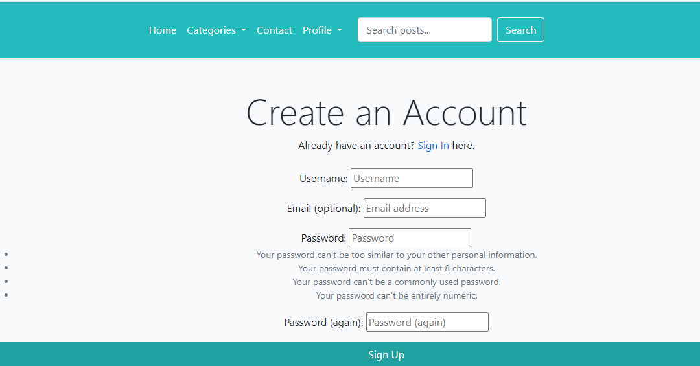
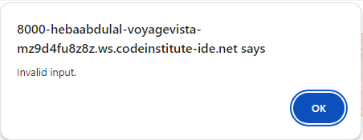

  

<h1 align="center">Voyage Vista</h1>

<h2>Welcome</h2>

Link to live website: [CLICK HERE!](https://ckz8780-django-voyagevista-app-19845c20e94f.herokuapp.com/)

# Introduction
Voyage Vista is a dynamic blogging platform tailored for travelers, adventurers, and enthusiasts of exploration. Designed with both content creators and readers in mind, Voyage Vista offers a user-friendly experience for sharing and discovering stories, tips, and insights about travel. Built using the Django web framework, the platform facilitates a seamless interaction between users, allowing them to create, share, and engage with content on various travel-related topics.

Voyage Vista is not just another blog; it’s a community-driven platform that connects people who share a passion for travel and exploration. Whether you're looking to share your latest adventure, find accommodation tips, or gather travel advice, Voyage Vista provides the perfect space for you.

## Categories on Voyage Vista
To ensure that content is well-organized and easily navigable, Voyage Vista offers specific categories under which users can classify their posts. These categories help users find content that matches their interests:
- **Destinations:** This category features posts about various travel destinations around the world. Whether you’re looking for a guide to a popular city or exploring hidden gems, this category is a treasure trove of travel inspiration.
- **Accommodation:** Finding the right place to stay is a crucial part of any travel experience. Posts in this category offer advice, reviews, and tips on various types of accommodation, from luxury hotels to budget-friendly hostels.
- **Travel Tips:** This category is packed with practical advice to make your travels smoother and more enjoyable. From packing tips to navigating foreign cultures, these posts are essential reading for both novice and seasoned travelers.
## Features of Voyage Vista
Voyage Vista is designed to provide a rich and engaging experience for both writers and readers. The platform includes a variety of features that enhance the overall user experience:

- **User Registration and Authentication:**

Users can easily sign up, create an account, and manage their profiles. Secure login and logout functionalities ensure that user data remains private and safe.

- **Post Creation and Management:**

Registered users can create and publish blog posts with ease. The platform provides an intuitive editor, allowing users to craft well-structured posts with images and text.
Users can edit their posts even after publication, ensuring that the content remains up-to-date and accurate.
- **Comments and User Interactions:**

Readers can engage with posts by leaving comments, which fosters a community discussion around the content. Comment moderation tools allow authors and admins to maintain a positive environment.
Users can like posts and save their favorite content for easy access later.
- **Categories:**

All posts are organized into predefined categories—Destinations, Accommodation, and Travel Tips—making it easy for users to browse and discover content based on their interests.
Search Functionality:

A robust search feature allows users to find posts by entering keywords. This helps in quickly locating specific content without having to browse through the entire site.
- **User Dashboard:**

Each user has a personalized dashboard where they can manage their posts, likes, and saved articles. This centralized view makes it easy for users to track their contributions and interactions on the platform.

- **Responsive Design:**

The platform is fully responsive, ensuring a seamless experience across all devices, whether accessed via desktop, tablet, or smartphone.
Admin Panel:

The admin panel allows site administrators to manage users, posts, comments, and categories efficiently. Admins can approve or reject posts and comments, ensuring the quality of content on the site.
- **Media Management:**

Integrated with Cloudinary, Voyage Vista allows users to easily upload, manage, and display images in their posts, enriching the visual appeal of the content.
- **SEO-Friendly:**

The platform is optimized for search engines, helping posts gain visibility and attract more readers organically.
- **Error Handling and Notifications:**

Comprehensive error handling ensures that users are guided through any issues they encounter with clear notifications and prompts.

# Contents
- [Introduction](#introduction)
    - [Categories on Voyage Vista](#categories_on_voyage_vista)
    - [Features of Voyage Vista](#features_of_voyage_vista)
- [UX - User Experience](#ux---user-experience)
    - [User Goals](#user_goals)
    - [UX Design Principles](#ux_design_principles)
- [Design](#design)
  - [Colour Scheme](#colour-scheme)
  - [Fonts](#fonts)
    - [Google Fonts](#google-fonts)
    - [Usage](#usage)
- [Project Planning](#project-planning)
  - [Strategy Plane](#strategy-plane)
  - [Agile Methodologies - Project Management:](#agile-methodologies---project-management)
    - [MoSCoW Prioritization:](#moscow-prioritization)
    - [User Stories, Milestones and Epics](#user-stories-milestones-and-epics)
      - [Users Stories](#users-stories)
      - [Milestones](#milestones)
      - [Epics](#epics)
  - [Scope Plane](#scope-plane)
  - [Structural Plane](#structural-plane)
  - [Framework & Aesthetic Layout](#framework--aesthetic-layout)
    - [Wireframes](#wireframes)
      - [Home Page Wireframes](#home-page-wireframes)
      - [Post Detail Page Wireframes](#post-detail-page-wireframes)
      - [Sign up form wireframe](#signup-form-wirefram)
      - [Log in wireframe](#log-in-wireframe)
      - [Add post wirefram](#add-post-wireframe)
      - [My Posts wireframe](#my-posts-wireframe)
      - [My Likes wireframe](#my-likes-wireframe)
      - [My Comments wireframe](#my-comments-wireframe)
      - [My Bookmarks wireframe](#my-bookmarks-wireframe)
      - [Sign out wireframe](#sign-out-wireframe)
      - [About us & Contact us wirefram](#about-us-contact-us-wireframe)
    - [Database Schema - Entity Relationship Diagram](#database-schema---entity-relationship-diagram)
      - [Database Schema](#database-schema)
      - [Entity Relationship Diagram (ERD)](#entity-relationship-diagram-erd)
      - [Tables Overview](#tables-overview)
      - [Relationships](#relationships)
      - [Design Considerations](#design-considerations)
- [Project Features](#project-features)
  - [Existing Features](#existing-features)
  - [User Interface and Page Overview](#user-interface-and-page-overview)
    - [Homepage](#homepage)
    - [User Registration](#user-registration)
    - [Login and Logout](#login-and-logout)
    - [User Dashboard](#user-dashboard)
    - [Add Post](#add-post)
    - [Post Details](#post-details)
    - [Search Functionality](#search-functionality)
    - [Comment and Interactions](#comment-and-interactions)
    - [Categories](#categories)
    - [My Bookmarks](#my-bookmarks)
    - [My Likes](#my-likes)
    - [My Comments](#my-comments)
    - [My Posts](#my-posts)
    - [Pagination](#pagination)
    - [Footer](#footer)
    - [Admin Panel](#admin-panel)
    - [Contact & About us](#contact--about-us)
  - [Future Considrations](#future-considerations)
- [Technology Used](#technology-used)
  - [Frontend](#frontend)
  - [Backend](#backend)
  - [Deployment and Version Control](#deployment-and-version-control)
  - [Development Tools](#development-tools)
  - [Libraries and Frameworks](#libraries-and-frameworks)
  - [Validation Tools](#validation-tools)
  - [Others](#others)
- [Testing](#testing)
- [Deployment](#deployment)
  - [GitHub](#github)
  - [Gitpod](#gitpod)
  - [Heroku](#heroku)
  - [Database](#database)
  - [Cloudinary Integration](#cloudinary-integration)
- [Cloning and Forking](#cloning-and-forking)
  - [Cloning the Repository](#cloning-the-repository)
  - [Forking the Repository](#forking-the-repository)
- [Credits](#credits)
  - [Code](#code)
  - [Media](#media)
  - [Acknowledgements](#acknowledgements)

  ## UX- User Experience
The user experience (UX) on Voyage Vista is thoughtfully designed to cater to both seasoned travelers and those new to the world of blogging. Every aspect of the platform is crafted with the user in mind, ensuring an intuitive, engaging, and seamless experience. Here’s an in-depth look at the UX design considerations for Voyage Vista:

### User Goals
Voyage Vista is designed to help users achieve their goals quickly and efficiently:

- **Discovering Travel Content:** Users can easily find posts that match their interests through categories, search functionality, and related posts.
- **Sharing Experiences:** Content creators can effortlessly publish posts, upload images, and manage their content.
- **Engaging with the Community:** Users can comment on posts, like content, and save articles for future reference, fostering a sense of community.
- **Finding Relevant Information:** The platform offers a structured layout that allows users to quickly locate the information they need, whether it's a travel tip, accommodation advice, or destination guide.

### UX Design Principles
Voyage Vista’s UX is built around key design principles to ensure a positive experience for all users:

- **Simplicity:** The platform features a clean, uncluttered design that makes navigation straightforward. Users can easily find what they’re looking for without unnecessary distractions.
- **Consistency:** A consistent layout, color scheme, and typography are used throughout the site to create a cohesive and familiar experience for users as they browse different pages.
- **Responsiveness:** The website is fully responsive, ensuring that users have a smooth experience whether they’re accessing it from a desktop, tablet, or mobile device.
- **Accessibility:** Voyage Vista is designed to be accessible to all users, including those with disabilities. Features like alt text for images, clear headings, and an intuitive navigation structure make the platform easy to use for everyone.
