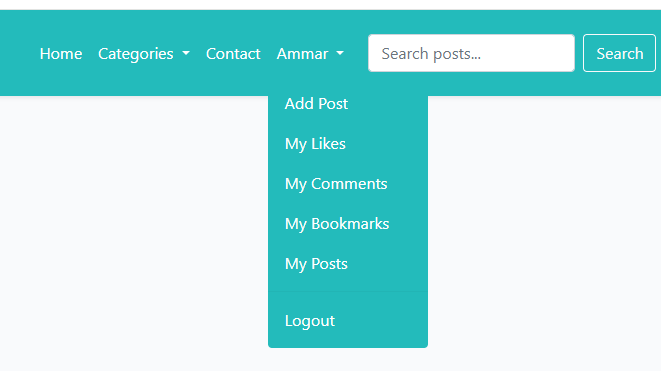
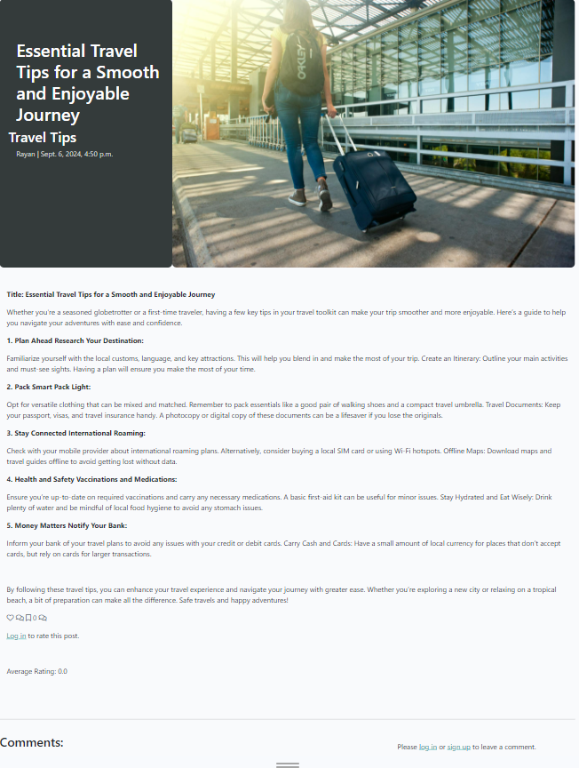
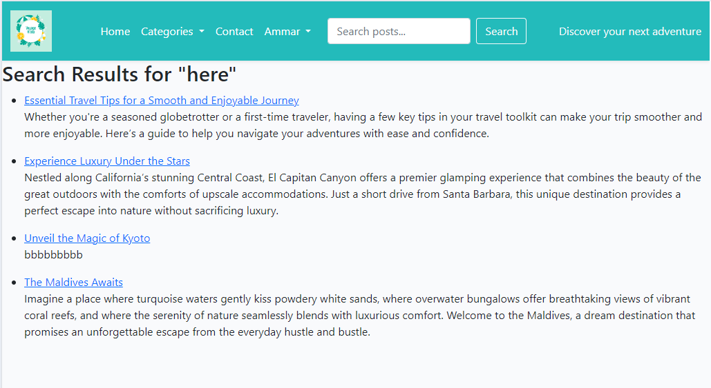
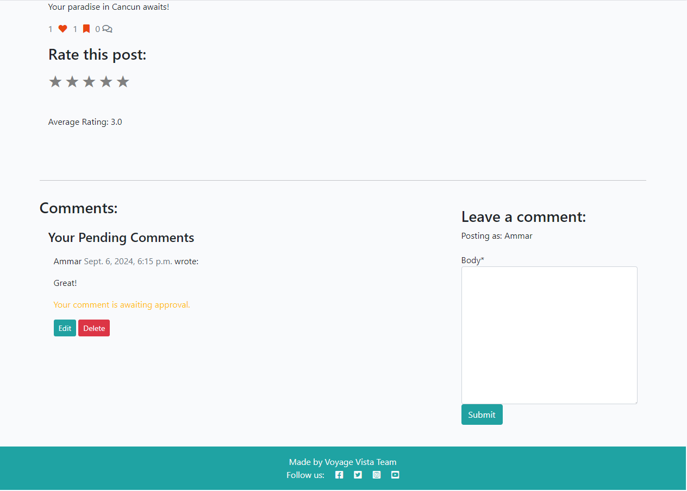

  

<h1 align="center">Voyage Vista</h1>

<h2>Welcome</h2>

Link to live website: [CLICK HERE!](https://ckz8780-django-voyagevista-app-19845c20e94f.herokuapp.com/)

# Introduction
Voyage Vista is a dynamic blogging platform tailored for travelers, adventurers, and enthusiasts of exploration. Designed with both content creators and readers in mind, Voyage Vista offers a user-friendly experience for sharing and discovering stories, tips, and insights about travel. Built using the Django web framework, the platform facilitates a seamless interaction between users, allowing them to create, share, and engage with content on various travel-related topics.

Voyage Vista is not just another blog; it’s a community-driven platform that connects people who share a passion for travel and exploration. Whether you're looking to share your latest adventure, find accommodation tips, or gather travel advice, Voyage Vista provides the perfect space for you.

## Categories on Voyage Vista
To ensure that content is well-organized and easily navigable, Voyage Vista offers specific categories under which users can classify their posts. These categories help users find content that matches their interests:
- **Destinations:** This category features posts about various travel destinations around the world. Whether you’re looking for a guide to a popular city or exploring hidden gems, this category is a treasure trove of travel inspiration.
- **Accommodation:** Finding the right place to stay is a crucial part of any travel experience. Posts in this category offer advice, reviews, and tips on various types of accommodation, from luxury hotels to budget-friendly hostels.
- **Travel Tips:** This category is packed with practical advice to make your travels smoother and more enjoyable. From packing tips to navigating foreign cultures, these posts are essential reading for both novice and seasoned travelers.
## Features of Voyage Vista
Voyage Vista is designed to provide a rich and engaging experience for both writers and readers. The platform includes a variety of features that enhance the overall user experience:

- **User Registration and Authentication:**

Users can easily sign up, create an account, and manage their profiles. Secure login and logout functionalities ensure that user data remains private and safe.

- **Post Creation and Management:**

Registered users can create and publish blog posts with ease. The platform provides an intuitive editor, allowing users to craft well-structured posts with images and text.
Users can edit their posts even after publication, ensuring that the content remains up-to-date and accurate.
- **Comments and User Interactions:**

Readers can engage with posts by leaving comments, which fosters a community discussion around the content. Comment moderation tools allow authors and admins to maintain a positive environment.
Users can like posts and save their favorite content for easy access later.
- **Categories:**

All posts are organized into predefined categories—Destinations, Accommodation, and Travel Tips—making it easy for users to browse and discover content based on their interests.
Search Functionality:

A robust search feature allows users to find posts by entering keywords. This helps in quickly locating specific content without having to browse through the entire site.
- **User Dashboard:**

Each user has a personalized dashboard where they can manage their posts, likes, and saved articles. This centralized view makes it easy for users to track their contributions and interactions on the platform.

- **Responsive Design:**

The platform is fully responsive, ensuring a seamless experience across all devices, whether accessed via desktop, tablet, or smartphone.
Admin Panel:

The admin panel allows site administrators to manage users, posts, comments, and categories efficiently. Admins can approve or reject posts and comments, ensuring the quality of content on the site.
- **Media Management:**

Integrated with Cloudinary, Voyage Vista allows users to easily upload, manage, and display images in their posts, enriching the visual appeal of the content.
- **SEO-Friendly:**

The platform is optimized for search engines, helping posts gain visibility and attract more readers organically.
- **Error Handling and Notifications:**

Comprehensive error handling ensures that users are guided through any issues they encounter with clear notifications and prompts.

# Contents
- [Introduction](#introduction)
    - [Categories on Voyage Vista](#categories_on_voyage_vista)
    - [Features of Voyage Vista](#features_of_voyage_vista)
- [UX - User Experience](#ux---user-experience)
    - [User Goals](#user_goals)
    - [UX Design Principles](#ux_design_principles)
- [Design](#design)
  - [Colour Scheme](#colour-scheme)
  - [Fonts](#fonts)
    - [Google Fonts](#google-fonts)
    - [Usage](#usage)
- [Project Planning](#project-planning)
  - [Strategy Plane](#strategy-plane)
  - [Agile Methodologies - Project Management:](#agile-methodologies---project-management)
    - [MoSCoW Prioritization:](#moscow-prioritization)
    - [User Stories, Milestones and Epics](#user-stories-milestones-and-epics)
      - [Users Stories](#users-stories)
      - [Milestones](#milestones)
      - [Epics](#epics)
  - [Scope Plane](#scope-plane)
  - [Structural Plane](#structural-plane)
  - [Framework & Aesthetic Layout](#framework--aesthetic-layout)
    - [Wireframes](#wireframes)
      - [Home Page Wireframes](#home-page-wireframes)
      - [Post Detail Page Wireframes](#post-detail-page-wireframes)
      - [Sign up form wireframe](#signup-form-wirefram)
      - [Log in wireframe](#log-in-wireframe)
      - [Add post wirefram](#add-post-wireframe)
      - [My Posts wireframe](#my-posts-wireframe)
      - [My Likes wireframe](#my-likes-wireframe)
      - [My Comments wireframe](#my-comments-wireframe)
      - [My Bookmarks wireframe](#my-bookmarks-wireframe)
      - [Sign out wireframe](#sign-out-wireframe)
      - [About us & Contact us wirefram](#about-us-contact-us-wireframe)
    - [Database Schema - Entity Relationship Diagram](#database-schema---entity-relationship-diagram)
      - [Database Schema](#database-schema)
      - [Entity Relationship Diagram (ERD)](#entity-relationship-diagram-erd)
      - [Tables Overview](#tables-overview)
      - [Relationships](#relationships)
      - [Design Considerations](#design-considerations)
- [Project Features](#project-features)
  - [Existing Features](#existing-features)
  - [User Interface and Page Overview](#user-interface-and-page-overview)
    - [Homepage](#homepage)
    - [User Registration](#user-registration)
    - [Login and Logout](#login-and-logout)
    - [User Dashboard](#user-dashboard)
    - [Add Post](#add-post)
    - [Post Details](#post-details)
    - [Search Functionality](#search-functionality)
    - [Comment and Interactions](#comment-and-interactions)
    - [Categories](#categories)
    - [My Bookmarks](#my-bookmarks)
    - [My Likes](#my-likes)
    - [My Comments](#my-comments)
    - [My Posts](#my-posts)
    - [Pagination](#pagination)
    - [Footer](#footer)
    - [Admin Panel](#admin-panel)
    - [Contact & About us](#contact--about-us)
  - [Future Considrations](#future-considerations)
- [Technology Used](#technology-used)
  - [Frontend](#frontend)
  - [Backend](#backend)
  - [Deployment and Version Control](#deployment-and-version-control)
  - [Development Tools](#development-tools)
  - [Libraries and Frameworks](#libraries-and-frameworks)
  - [Validation Tools](#validation-tools)
  - [Others](#others)
- [Testing](#testing)
- [Deployment](#deployment)
  - [GitHub](#github)
  - [Gitpod](#gitpod)
  - [Heroku](#heroku)
  - [Database](#database)
  - [Cloudinary Integration](#cloudinary-integration)
- [Cloning and Forking](#cloning-and-forking)
  - [Cloning the Repository](#cloning-the-repository)
  - [Forking the Repository](#forking-the-repository)
- [Credits](#credits)
  - [Code](#code)
  - [Media](#media)
  - [Acknowledgements](#acknowledgements)

  ## UX- User Experience
The user experience (UX) on Voyage Vista is thoughtfully designed to cater to both seasoned travelers and those new to the world of blogging. Every aspect of the platform is crafted with the user in mind, ensuring an intuitive, engaging, and seamless experience. Here’s an in-depth look at the UX design considerations for Voyage Vista:

### User Goals
Voyage Vista is designed to help users achieve their goals quickly and efficiently:

- **Discovering Travel Content:** Users can easily find posts that match their interests through categories, search functionality, and related posts.
- **Sharing Experiences:** Content creators can effortlessly publish posts, upload images, and manage their content.
- **Engaging with the Community:** Users can comment on posts, like content, and save articles for future reference, fostering a sense of community.
- **Finding Relevant Information:** The platform offers a structured layout that allows users to quickly locate the information they need, whether it's a travel tip, accommodation advice, or destination guide.

### UX Design Principles
Voyage Vista’s UX is built around key design principles to ensure a positive experience for all users:

- **Simplicity:** The platform features a clean, uncluttered design that makes navigation straightforward. Users can easily find what they’re looking for without unnecessary distractions.
- **Consistency:** A consistent layout, color scheme, and typography are used throughout the site to create a cohesive and familiar experience for users as they browse different pages.
- **Responsiveness:** The website is fully responsive, ensuring that users have a smooth experience whether they’re accessing it from a desktop, tablet, or mobile device.
- **Accessibility:** Voyage Vista is designed to be accessible to all users, including those with disabilities. Features like alt text for images, clear headings, and an intuitive navigation structure make the platform easy to use for everyone.

# Design
Voyage Vista’s design is crafted to enhance user engagement and provide a visually appealing and functional experience. The design elements focus on creating a cohesive and immersive environment that complements the website's travel content.

## Color Scheme
The colour scheme of Voyage Vista is inspired by a refreshing travel aesthetic, incorporating a palette that reflects tranquility and adventure. Key colors include:

- **Primary Color:** A calming teal (#23bbbb) used for navigation bars and buttons, creating a soothing visual experience.
- **Accent Colors:** Complementary shades like dark teal (#1fa3a3) and white for text and backgrounds, ensuring readability and contrast.
- **Neutral Colors:** Subtle greys and off-whites for backgrounds and secondary elements, maintaining a clean and professional look.
The chosen colors enhance the website's overall ambiance, aligning with the theme of exploration and travel.

## Fonts
Voyage Vista employs a well-selected combination of fonts to ensure readability and aesthetic appeal.

- **Google Fonts**
    - Roboto: A versatile and modern font used for body text. It features a balanced design that improves readability and accessibility.
    - Lato: This font complements Roboto and is used for headings and subheadings. Its slightly rounded design provides a friendly and approachable feel.
- **Usage:**
    - Roboto: Applied for general content, including articles and descriptions, ensuring clear and easy-to-read text.
    - Lato: Used for headings, navigation items, and call-to-action buttons, adding emphasis and improving visual hierarchy.
By integrating these fonts, Voyage Vista achieves a harmonious design that enhances the user experience through clear, readable text and a visually appealing layout.

# Project planning

## Strategy Plane
The strategy plane involves defining the high-level goals and objectives of the project. It includes understanding user needs, business requirements, and project constraints to create a roadmap that guides development. For VoyageVista, this means ensuring that our blog platform meets user expectations for usability, functionality, and design while aligning with business goals.

### Agile Methodologies - Project Management

  Story Points Allocation Story points are used to estimate the effort required to complete user stories or tasks. Each story point represents a unit of work or complexity, helping the team understand the relative effort needed. In VoyageVista, this means assigning points to tasks like developing new features, fixing bugs, or making design changes.
  - Sprint Planning Example:

    Here is an example of how story points are managed and allocated across different categories in sprints:
    - Total Story Points for the Sprint: 128
    - Must-have Points: 81 (63.3% of the total)
    - Should-have Points: 28 (21.9% of the total)
    - Could-have Points: 19 (14.8% of the total)

    - Example Milestones:
    - Milestone 1: User Engagement
  - Total Story Points: 46
  - Breakdown:
    - Must-have: 21 points
    - Should-have: 8 points
    - Could-have: 17 points
    - Milestone 2: Content Discovery
  - Total Story Points: 35
  - Breakdown:
    - Must-have: 22 points
    - Should-have: 13 points

### MoSCoW Prioritization

MoSCoW is a prioritization technique used to classify requirements into categories:

- **Must Have:** Essential features that are critical for the project's success.
- **Should Have:** Important but not crucial; they add significant value.
- **Could Have:** Desirable features that are not critical and can be included if time permits.
- **Won't Have:** Features that are not necessary for the current project phase.
For VoyageVista, "Must Have" might include user authentication and post creation, while "Could Have" could include advanced search filters, dashboard and sorting options.

## User Stories, Milestones and Epics
### User stories
User Stories are concise descriptions of tasks or needs from the user's perspective. They are written in plain language, focusing on what the user wants to achieve and the value or outcome they seek, rather than technical details.

| Title | User Story | MoSCoW Priority | Milestone |
|-------|------------|----------|-----------|
| Seamless sign up Experience | As a user, I **want** a seamless **sign-up** experience so that I can quickly **create** an account and start using the website without any hassle. | **MUST HAVE** | User Authentication |
| Logout | As a **registered user**, I want to **log out** securely, so that my **account remains safe** when I am not using it. | **MUST HAVE** | User Authentication |
| Add Post | As a **registered user**, I want to be able to **add a new post** easily, so that I can **share** my thoughts or content with others. | **MUST HAVE** | User Engagement |
| Create drafts | As a **website owner**, I want the ability to **create** draft posts, so that I can **work on writing** the content gradually and finalize it at a later time. | **MUST HAVE** | Content Mangement and Moderation |
| Seamless Login Experience | As a **registered user**, after logging in, I **expect** the login and sign up buttons to **disappear** from the navigation bar, and a sign out button to **appear** instead. | **MUST HAVE** | User Authentication |
| My Likes | As a **registered user**, I want to **see** a list of all the posts I have liked, so that I can easily **access** content that I found interesting or valuable. | **SHOULD HAVE** | User Engagement |
| Browse Posts with Pagination | As a user, I want to **view a paginated list** of posts, so that I can easily **navigate through** multiple posts and select which ones I want to read. | **SHOULD HAVE** | Content Discovery |
| Browse Categories | As a **user**, I want to easily **find blog posts** on topics of interest by browsing through different categories so that I can quickly **access** content that is relevant to me. | **SHOULD HAVE** | Cotent Discovery |
| Easy Contact Option | As a **registered user**, I want to easily **contact** the website administrators so that I can **make inquiries** or provide feedback. | **SHOULD HAVE** | Cotent Discovery |
| Quick Search Functionality | As a **user**, I want to **search** for specific destinations, hotels, or adventures, so I can **find** relevant information quickly. | **SHOULD HAVE** | Cotent Discovery |
| Rating Posts | As a **registered user**, I want to **rate** destinations, hotels, and adventures based on my experiences so that I can **share** my feedback and help others make informed decisions. | **COULD HAVE** | User Engagement |
| Delete Comments | As a **registered user**, I want to be able to **delete** my comments on a post so that I **have control** over my participation in discussions and can remove comments I no longer wish to be associated with. | **COULD HAVE** | User Engagement |
| Bookmarking | As a **registered user**, I want to **bookmark** posts or destinations that I **find** interesting so that I can easily reference them in the future. | **COULD HAVE** | User Engagement |
| My Bookmarks | As a **registered user**, I want to **access** a list of posts I have bookmarked, so that I can quickly **find** content I saved for later. | **COULD HAVE** | User Engagement |
| Edit comments on a post | As a **registered user**, I want to be able to **edit** my comments on a post so that I can **correct** or clarify my contributions, ensuring they remain accurate and relevant. | **COULD HAVE** | User Engagement |

### Milestones
Milestones in a project serves as a key checkpoint or goal along the project's timeline. It signifies the completion of a major phase, the achievement of a crucial objective, or the meeting of an important deadline. Milestones are essential for monitoring progress, setting deadlines, and ensuring alignment among team members and stakeholders regarding major project events or accomplishments. Unlike individual tasks or user stories, milestones do not involve direct work but act as indicators that a significant portion of the project has been completed.

### Epics
Epics are large bodies of work that can be broken down into smaller, more manageable tasks or user stories. They represent significant features or functionalities that contribute to the overall goal of the project.

- User Engagement and Interaction

  - Description: This epic encompasses all user interactions with posts, comments, and personal engagement features.
  - Associated User Stories:
    - Rating posts.
    - Delete comments on a post.
    - Edit comment on a post.
    - Bookmarking.
    - Edit post.
    - Delete post.
    - Like/Unlike posts.
    - My Cooments.
    - My Likes.
    - My Bookmarks.
    - My Posts.
    - Leave a comment.
    
- Content Discovery and Management

  - Description: This epic includes all functionalities related to discovering, browsing, and managing content on the platform.
  - Associated User Stories:
      - Browsing categories.
      - Open Post.
      - Browsing posts without login.
      - Browse posts with pagination.
      - Easy Contact Option.
      - Quick Search Functionality.
      - Browse and Discover New Travel Experiences.

- User Authentication and Account Management

  - Description: This epic covers all features related to user authentication, registration, and account management.
  - Associated User Stories:
    - Seamless Signup Experience.
    - Logout.
    - Seamless Login Experience.
    - Implement Authentication State Handling.

- Content Management and Moderation
  - Description: This epic focuses on all functionalities related to managing, moderating, and curating content on the platform.
  - Associated User Stories:
    - Moderate User-Generated Content.
    - Manage Recommended Content.
    - Approve Comments.
    - Create drafts.

# Scope Plane

In project management and design, the Scope Plane defines the boundaries and deliverables of a project. It is essential for ensuring that all project stakeholders have a clear understanding of what is included and excluded from the project's scope. Here's an overview of the Scope Plane in the context of your project:

- Project Boundaries
In-Scope: Defines what functionalities, features, and elements are included in the project. For instance, in your project, this includes user authentication, content management, rating systems, and user engagement features.
Out-of-Scope: Clarifies what is not included in the project. For example, advanced content filtering and interactive maps integration are noted as future considerations or not part of the current project scope.
- Deliverables
Functional Requirements: Detailed specifications of what the system should do. These include user stories like rating posts, browsing categories, and viewing ratings.
Non-Functional Requirements: Aspects like performance, security, and usability that the project must meet. This includes responsiveness, data protection, and a seamless user experience.
- Project Objectives
Primary Objectives: Achieve core functionalities such as user registration, content creation, and interaction with posts (e.g., commenting, liking).
Secondary Objectives: Enhancements and additional features that improve the user experience, like custom branding and backup solutions.

- Stakeholder Expectations
User Stories: Capture the needs and expectations of users, ensuring that the project deliverables meet these requirements.
Acceptance Criteria: Define how the success of the deliverables will be measured, ensuring that each feature meets the defined user needs.
- Scope Management
Scope Control: Procedures to manage changes and ensure that the project remains within the defined scope. This includes handling requests for additional features or modifications.
Scope Verification: Regular reviews and validation to confirm that project deliverables align with the agreed-upon scope.

- Exempel from Voyage Vista Project:
    - In-Scope:

      - User registration and authentication
      - Rating and commenting on posts
      - Bookmarking and saving posts
      - Browsing and discovering posts by categories
    - Out-of-Scope:

      - Advanced content filtering
      - Interactive maps integration

The Scope Plane ensures that all project aspects are well-defined and understood, helping to avoid scope creep and ensuring that the project delivers what is expected within the agreed-upon constraints.

## Structural Plane

The Structural Plane defines how the website is organized and navigated, focusing on information architecture, navigation, and interaction design to enhance user experience.

- Content Organisation
    - Homepage:
      - Purpose: Acts as the entry point to the site, providing an overview of key content and facilitating quick access to major categories.
      - Features:
        - Featured Content: Highlights popular or new posts, destinations, and tips.
        - Category Overview: Direct links to main categories like Destinations, Accommodation, and Travel Tips.
        - Search Bar: Prominent search functionality for easy content discovery.

    - Category Pages:
      - Purpose: Dedicated pages for each major category, allowing users to explore content specific to their interests.
      - Features:
        - Articles and Posts: Lists of posts and articles categorized under each topic.

    - Post Detail Pages:
      - Purpose: Provides in-depth content on selected posts, offering comprehensive information and user interaction options.
      - Features:
        - Full Content Display: Detailed text, images, and multimedia elements related to the post.
        - User Interaction: Options for commenting, rating, and liking/unliking.

    - About & Contact Pages:
      - Purpose: Facilitates user interactions and provides information about the site and its administrators.
      - Features:
        - About Page: Information about the site’s purpose, team, and mission.
        - Contact Page: Contact form or details for reaching out to the website administrators.

    - Registration and Sign-In Pages:
      - Purpose: Allows users to create accounts and log in for personalized interactions.
      - Features:
        - Registration Form: Fields for new users to sign up.
        - Login Form: Fields for existing users to log in.

    - Dahboard Page:
      - Purpose: Personal space for users to manage their activities and preferences.
      - Features:
        - My Posts: List of posts authored by the user.
        - My Bookmarks and Likes: Shows content bookmarked or liked by the user.
        - My Comments: List of comments made by the user.
        - My Likes: List of posts liked by the user.

## Framework & Aesthetic Layout
  ### Wireframes
  #### Home Page Wireframe
    

    
Click to View Home Page wireframe

    
    

  #### Post detail wireframes
    

    
Click to view Post detail wireframes

    **Without logging in or signing up**

    
    
    **Authenticated user**

    
    

  #### Sign up wireframe
  

  
Click to view Sign up Form wireframe

  
  

  #### Log in wireframe
  

  
Click to view Log in Forem wirefram

  
  

  #### Add post wireframe
  

  
Click to view Add post Form wirefram

  
  

  #### My Posts wireframe
  

  
Click to view My Posts wireframe

  
  

  #### My Likes wireframe
  

  
Click to view My Likes wireframe

  
  

  #### My Comments wireframe
  

  
Click to view My Comments wireframe

  
  

  #### My Bookmarks wireframe
  

  
Click to view My Bookmarks wireframe

  
  

  #### Sign Out wireframe
  

  
Click to view Sign out Form wireframe

  
  

### Database Schema- Entity Relationship Diagram
  I utilized dbdiagram to create the ERD for this project.

  #### Database Schema
  The architecture of the Software Stacks application is built on a well-organized database schema, ensuring streamlined data management and efficient retrieval processes. Below is an overview of how the database is structured and the relationships between its various components.

  [dbdiagram](https://dbdiagram.io/d/66a404f48b4bb5230e7997fd)

  #### Entity Relationship Diagram (ERD)
  The ERD visually represents the database schema of Software Stacks. It outlines the system's key tables, their attributes, and how these tables are interconnected within the overall structure.

  

  
Click to view The Database Schema

  
  

  #### Tables Overview

- **User**: Represents the individuals who interact with the platform. Each user has a unique ID and profile details (e.g., username, email). Users can perform actions like posting content, commenting, rating, liking, and saving posts.

- **Post**:  This entity holds the main content created by users. Each post has a title, description, associated category, and is linked to the user who created it. Posts can also include media such as images and can be rated, liked, and bookmarked by other users.

- **Comment**: Comments allow users to provide feedback or engage in discussions on posts. Each comment is tied to both the post and the user who made the comment. Comments can be edited or deleted by the user who made them.

- **Category**: Represents different topics or types of content (e.g., destinations, accommodations, travel tips). Posts are organized into these categories to make content browsing easier for users.

- **Rating**: Represents user ratings on posts, destinations, hotels, or adventures. Users can assign a rating to a post based on their experience, which helps others make informed decisions.

- **PostLikes**: Tracks the posts that users have liked. Each entry links a user with a specific post they liked, allowing users to express appreciation for content.

- **PostSaves**: Manages the posts that users have saved or bookmarked for future reference. This allows users to easily revisit posts they find valuable or interesting.

#### Relationships

- **One-to-Many**:
  - User to Post (One user can author many posts).
  - User to Comment (One user can write many comments).
  - User to Rating (One user can give many ratings).
  - Post to Comment (One post can have many comments).
  - Post to Rating (One post can have many ratings).
- **Many-to-One**:
  - Post to Category (Many posts belong to one category).
  - PostLikes to Post (Many users can like one post).
  - PostSaves to Post (Many users can save one post).
- **Many-to-Many**:
  - This relationship is implicit in PostLikes and PostSaves, where many users can interact with many posts (via likes or saves), though represented as many-to-one links to the Post and User tables.

# Project Features
## Existing Features
The project includes a variety of features designed to enhance user engagement, content discovery, and interaction with the platform. These features provide both registered and unregistered users with access to posts, categories, and ratings, while allowing registered users to engage more deeply with content by creating, managing, and interacting with posts, comments, and ratings. Below is a table summarizing the access levels and CRUD functionality for each feature.

| Feature                | Unregistered User Access | Registered User Access | CRUD Functionality         |
|------------------------|--------------------------|-------------------------|----------------------------|
| View Posts              | Yes                      | Yes                     | Read                       |
| Create Post             | No                       | Yes                     | Create                      |
| Edit/Delete Post        | No                       | Yes (own posts only)     | Update, Delete             |
| Like/Unlike Posts       | No                       | Yes                     | Create, Delete (like)      |
| Comment on Posts        | No                       | Yes                     | Create, Update, Delete, Read     |
| Bookmark Posts          | No                       | Yes                     | Create, Delete (bookmark)  |
| Rate Posts          | No                       | Yes                     | Create, Read (rating)  |
| View Dashboard          | No                       | Yes                     | Read (own data)            |
| View Categories         | Yes                      | Yes                     | Read                       |
| View number of likes on posts        | Yes                      | Yes                     | Read                       |
| View comments on posts         | Yes                      | Yes                     | Read                       |
| View average rating on posts         | Yes                      | Yes                     | Read                       |
|  Contact/Send Inquiry          | Yes                      | Yes                     | Create                       |
| Search          | Yes                       | Yes                     | Read  |
| View Post detail          | Yes                       | Yes                     | Read  |

## User Interface and Page Overview

### Homepage
The homepage serves as the central hub of the website, offering a comprehensive overview of key features and latest updates. It includes prominent sections such as featured articles, direct links to major categories, and highlights of popular posts.

### User Registration
The user registration feature allows new users to create an account on the website by providing necessary details like a username, email, and password. Once registered, users can log in and access additional features like posting, commenting, and interacting with content.

###  Login and Logout
Users can securely log in to their accounts using their credentials (username or email and password). Once authenticated, users gain access to personalized features like adding posts and managing their profile. A logout option is available to safely end the session.

**Logout**

### User Dashboard
The user dashboard is a personalized section where users can view and manage their activities such as posts, comments, bookmarks, and interactions. It typically displays user-specific data and offers controls for managing posts, profile settings, and other preferences.

### Add Post
Registered users can add new posts via an intuitive form. The form includes fields for the post title, content (integrated with the Quill rich text editor), categories, tags, and an option to upload images. Posts can either be published directly or submitted for approval.

### Post Details
Each post has a dedicated details page, displaying the full content, author information, categories, tags, and any comments associated with the post. Users can interact with the post by liking, bookmarking, or commenting on it.

### Search Functionality
Users can search for posts using keywords, titles, or categories. The search feature dynamically filters through the content and displays relevant results based on the query.

### Comment and Interactions
Users can comment on posts and reply to other users' comments, fostering discussions. The interaction options also include liking posts and comments, and bookmarking posts for later reference.

### Categories
Posts are organized into different categories to help users filter and browse content more efficiently. Users can view posts based on the category they select from the navigation bar or post listings.

### My Bookmarks
Users can save posts to their bookmarks, allowing them to revisit these posts later. The "My Bookmarks" section in the user dashboard lists all bookmarked posts for easy access.

### My Likes
The "My Likes" section in the user dashboard allows users to keep track of all the posts they've liked. It serves as a quick reference to the user's liked content.

### My Comments
Users can view and manage all their comments in one place through the "My Comments" section in the dashboard. This allows them to quickly navigate to posts they have commented on.

### My Posts
The "My Posts" section in the dashboard displays all the posts created by the user, including those that are published, under review, or drafts. Users can manage or edit these posts from here.

### Pagination
The pagination feature ensures that posts or comments are divided into pages for easy navigation. Instead of loading all content at once, users can browse through posts in a paginated manner.

### Footer
The footer section typically includes useful links such as contact information, social media links, privacy policy, and terms of service. It also may display brief information about the website.

### Admin Panel
The admin panel allows site administrators to manage content, users, comments, categories, and other settings. The admin can approve or reject posts, moderate comments, and control user activity.

### Contact & About us
These static pages provide users with information about the website, the team, and how to get in touch. The "Contact" page may include a form for sending messages, while the "About" page details the purpose of the site and its mission.

## Future Considerations

- **Improved Pagination UX**
  - Infinite Scrolling: Implement infinite scrolling for a more seamless user experience, removing the need for manual pagination controls.
  - Ajax-Based Pagination: Use Ajax to load new comments without requiring a full page reload, providing a more dynamic and responsive user interface.

- **Enhanced Comment Moderation**
  - Admin Dashboard: Build an admin interface to manage pending comments, where moderators can approve or reject comments in bulk.
  - Comment Reporting: Add a feature allowing users to report inappropriate comments for review by the admin team.

- **Real-Time Comments**
  - WebSockets Integration: Implement real-time comment updates using WebSockets, ensuring users see new comments without refreshing the page.
  - Live Notifications: Notify users in real time when their comment gets a reply or is approved.

- **Advanced Rating and Like System**
  - Rating Insights: Provide users with insights into the rating distribution (e.g., average rating, number of 5-star ratings, etc.).
  - Multiple Reactions: Expand the "like" feature to support a variety of reactions (e.g., love, angry, wow) similar to social media platforms.

- **Better User Engagement Features**
  - Comment Threading: Enable nested or threaded comments to allow users to reply to specific comments, enhancing discussion flow.
  - Upvoting/Downvoting Comments: Allow users to upvote or downvote comments to promote high-quality discussions.

- **User Profiles and Activity Tracking**
  - Leaderboard: Introduce a leaderboard for the most active commenters or top-rated posts to encourage more engagement.

- **Accessibility and Internationalization**
  - Multilingual Support: Add support for multiple languages to reach a broader audience by translating the app’s interface and user-generated content.
  - Accessibility Improvements: Ensure the app is fully accessible by adhering to WCAG standards, improving screen reader compatibility, and providing text alternatives for all multimedia content.

- **Performance Optimizations**
  - Database Indexing: Optimize database queries related to comment fetching and pagination, ensuring the app remains performant as the number of comments grows.
  - Caching: Implement caching for frequently accessed content (e.g., comments, ratings) to reduce server load and improve response times.

- **Mobile-Friendly Design**
  - Responsive Layout Improvements: Enhance the mobile and tablet user experience by refining responsive design elements and ensuring smooth navigation on smaller screens.
  - Mobile App Integration: Consider building a native mobile app or adding progressive web app (PWA) support for an improved mobile experience.

- **Third-Party Authentication**
  - OAuth Integration: Implement third-party authentication providers such as Google, Facebook, or GitHub, allowing users to register and log in using existing accounts.

  # Technology Used

## Frontend
  - HTML5: Used for structuring the content on the web pages.
  - CSS3: Provides the styles and layout of the application, ensuring a responsive design.
  - JavaScript: Used for interactive elements and client-side validation.
  - Bootstrap: A CSS framework used for responsive design and pre-built components like forms, buttons, and pagination.
  - Jinja/Django Templating Engine: Used to dynamically generate HTML content with data passed from the backend.
## Backend
  - Python: The core programming language used to build the backend logic of the application.
  - Django: A high-level Python web framework that handles the server-side logic, URL routing, and ORM (Object-Relational Mapping) for database interaction.
  - Django ORM: Used to interact with the database, managing queries, and models in a Pythonic way.
  - PostgreSQL: PostgreSQL has been used in production for better performance.
## Libraries and Frameworks
  - Django Framework
    - Django (Django==5.0.6): The core web framework you're using to build your project. It provides features like ORM, URL routing, templates, and forms.
  - Database Management
    - dj-database-url (dj-database-url==0.5.0): Simplifies configuring the database URL for your project, especially useful in deployment environments like Heroku.
    - psycopg2 and psycopg2-binary (psycopg2==2.9.9 & psycopg2-binary==2.9.9): PostgreSQL adapters that allow Django to interact with a PostgreSQL database.
  - Cloudinary Integration
    - cloudinary (cloudinary==1.40.0): A library for integrating with Cloudinary, a cloud-based image and video management platform.
    - django-cloudinary-storage (django-cloudinary-storage==0.3.0): Facilitates using Cloudinary for media file storage in Django projects.
    - dj3-cloudinary-storage (dj3-cloudinary-storage==0.0.6): Another Cloudinary storage plugin for handling media uploads and storage with Django 3+.
  - Form Handling & Styling
    - django-crispy-forms (django-crispy-forms==2.1): A Django package to create and style forms with ease. It provides advanced layout and styling capabilities.
    - crispy-bootstrap4 (crispy-bootstrap4==2024.1): Adds support for rendering forms using the Bootstrap 4 CSS framework, ensuring consistent and responsive form designs.
  - Authentication
    - django-allauth (django-allauth==0.63.3): A comprehensive authentication package for Django that supports user registration, login, social account integration, email verification, and more.
  - Media Management
      - django-summernote (django-summernote==0.8.20.0): Integrates the Summernote WYSIWYG editor with Django, allowing users to create and edit rich-text content (HTML) in forms.
  - CORS Headers
    - django-cors-headers (django-cors-headers==4.3.1): A Django application for handling Cross-Origin Resource Sharing (CORS), enabling your API or frontend to communicate with the backend across different origins.
  - ASGI Support
    - asgiref (asgiref==3.8.1): Provides asynchronous server gateway interface (ASGI) support, allowing Django to run with async-capable web servers. It's a part of Django's stack for supporting real-time applications.
  - Production Web Server
    - gunicorn (gunicorn==22.0.0): A Python WSGI HTTP server commonly used to deploy Django applications in production environments.
  - Timezone and SQL Parsing Utilities
    - pytz (pytz==2024.1): A library for accurate and cross-platform timezone handling in Python.
    - sqlparse (sqlparse==0.5.0): A tool used for parsing SQL queries, which is integrated into Django for database query parsing.
  - Django Pagination: Handles the pagination logic, allowing comments to be split across multiple pages.
  - JQuery: Provides additional interactivity on the frontend, particularly for handling AJAX requests, form submission, and comment edit actions.

## Deployment
  - Gunicorn: A Python WSGI HTTP Server used to run the Django application in production.
  - Nginx: A web server used for serving static files, load balancing, and as a reverse proxy in production environments.
  - Heroku/AWS EC2/DigitalOcean: (Pick based on your deployment platform) Used to deploy the application to a cloud environment for public access.
  - AWS S3: For serving static and media files (images, CSS, JS) in a scalable manner.
  - Docker (optional): For containerizing the application to ensure consistency between development, staging, and production environments.
## Version Control
  - Git: The version control system used to track changes in the project.
  - GitHub/GitLab: (Pick the relevant one) Used as the remote repository to host the code, collaborate with other developers, and track issues and pull requests.
  - Heroku: Platform as a service (PaaS) for deploying applications.

## Validation Tools
- [**W3C Markup Validation Service**](https://validator.w3.org/): For validating HTML5 code.
- [**W3C CSS Validation Service**](https://jigsaw.w3.org/css-validator/): For validating CSS3 code.
- [**JSHint**](https://jshint.com/): A tool that helps to detect errors and potential problems in JavaScript code.
- [**CI Python Linter**](https://pep8ci.herokuapp.com/): Analyzes Python code to look for bugs and signs of poor quality.
- [**Google Lighthouse**](https://developers.google.com/web/tools/lighthouse): For auditing performance, accessibility, and search engine optimization of web pages.

## Others
- Cloudinary: An end-to-end image and video management solution.
- Favicon.io: To generate favicon icons for the website.
- Font Awesome: Provides icons for enhancing UI/UX.
- Tiny Png: To compress the images.

## Testing
For details on testing and validation, please see the information provided in the [TESTING.md](TESTING.md) file.

# Deployment
The deployment process for the Software Stacks project spans multiple platforms, including GitHub, Gitpod, Heroku, ElephantSQL, and Cloudinary. Each platform plays a crucial role in ensuring smooth deployment and management of the application. Below is an overview of how these services are used, along with their respective URLs:

- **GitHub**
Repository Management: The project begins with a GitHub repository, where all code and documentation are stored. This serves as the main hub for version control and collaboration. The repository allows contributors to manage the project through features like pull requests and issue tracking.

- **Gitpod**
Development Environment: Gitpod is employed as the cloud-based IDE for coding, testing, and debugging. Its direct integration with GitHub enables seamless workflow between writing code and pushing it to the repository, allowing developers to work from any machine without local setup.

- **Heroku**
Application Hosting: The live application is deployed on Heroku. The platform is linked to the GitHub repository, enabling automatic deployments. Each push to the main branch initiates a deployment on Heroku.

- **Heroku Setup Process:**
  - Create a new app in Heroku.
  - Connect the app to your GitHub repository.
  - Configure environment variables in Heroku, such as DATABASE_URL, SECRET_KEY, CLOUDINARY_URL, and DISABLE_COLLECTSTATIC (used temporarily for deployment).
  - Deploy the main branch through the Heroku dashboard or enable automatic deployment for every push.
  - Heroku also requires two specific files to deploy your project:

requirements.txt: Contains a list of the project’s dependencies. To install these dependencies, use the command:
  - pip3 install -r requirements.txt
  - If additional packages are installed, the file must be updated with:
  - pip3 freeze --local > requirements.txt
  - Procfile: Specifies how Heroku should run the application. You can create this file with the following command (replace app_name with your Django app's name where settings.py is located):
  - echo web: gunicorn app_name.wsgi > Procfile
  - This structured deployment process ensures that the Software Stacks application remains manageable, scalable, and efficiently deployed across these platforms.

  ## Database
  For the project I've used the database PostgresSQL that has been created by Code Institute.

  ## Cloudinary Integration
  Cloudinary is utilized to host media files, such as images, thereby offloading static file handling from Heroku. This improves performance and scalability.

  - **Steps for Cloudinary Integration:**
    - Create a Cloudinary account.
    - Configure Cloudinary settings in your Django settings file using the API keys provided.
    - Implement Django’s storage backend for Cloudinary to manage media uploads.

  # Cloning and Forking the Repository:
  ## Cloning the Repository
  - Clone the repository using the following command: git clone [GitHub repository](https://github.com/HebaAbdulal/voyage_vista)
  - Change into the project directory: cd software-stacks-p4
  - Install the required dependencies: pip install -r requirements.txt
  - Set up local environment variables in a .env file.
  - Apply migrations: python manage.py migrate
  - Start the development server: python manage.py runserver

  ## Forking the Repository:

- **For Contributions:**

    - Fork the repository on GitHub.
    - Clone your forked repository to your local machine.
    - Follow the local setup steps mentioned above.
    - Make your changes and push them to your fork.
    - Submit a pull request from your fork to the original repository.

