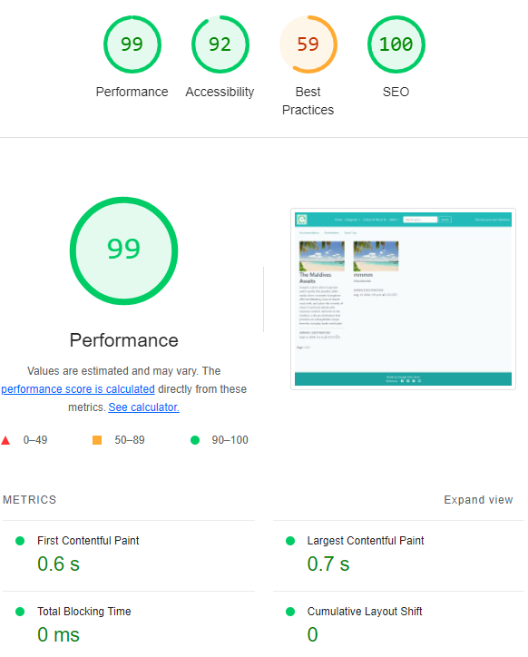
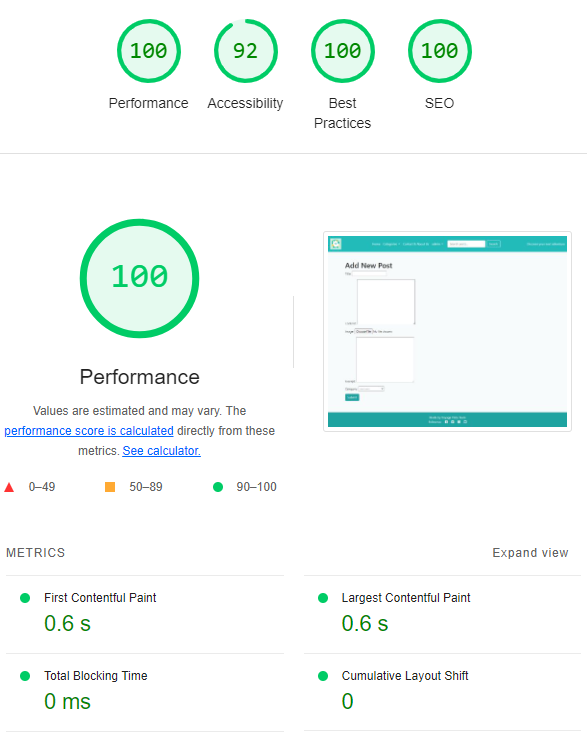

# Testing

This is the TESTING file for the [Voyage Vista](https://https://ckz8780-django-voyagevista-app-19845c20e94f.herokuapp.com//) website.

Return back to the [README.md](README.md) file.

## Testing  Table of Contents  
- [Testing](#testing)
  - [Testing  Table of Contents](#testing--table-of-contents)
  - [Validation](#validation)
      - [HTML Validation](#html-validation)
      - [Python Validation](#python-validation)
      - [CSS Validation](#css-validation)
      - [JavaScript Validation](#javascript-validation)
      - [Browser Compatibility](#browser-compatibility)
      - [Lighthouse Assessment](#lighthouse-assessment)
      - [Wave Accessibility Assessment](#wave-accessibility-assessment)
  - [Manual Testing](#manual-testing)
    - [Form Validation](#form-validation)
    - [Usre Inputs](#user-inputs)
    - [Django Messages Testing](#django-messages-testing)
    - [User Story Testing](#user-story-testing)
    - [Responsiveness](#responsiveness)
  - [Bugs](#bugs)
    - [Solved Bugs](#solved-bugs)
    - [Unsolved Bugs](#unsolved-bugs)
  - [Automated Testing](#automated-testing)
    - [Executing the Tests](#escuting-the-tests)
    - [Test Database](#test-database)
    - [Test Database Management](#test-database-management)

## Validation
To guarantee the Software Stacks application is reliable, user-friendly, and accessible, a range of validation methods were applied. These validations ensure that the application adheres to development standards and delivers a smooth user experience across various platforms and browsers. Here’s a summary of the validation procedures used:

### HTML Validation
- **Tool Used:** [HTML W3C Markup Validator](https://validator.w3.org/)
- **Objective:** Validates the HTML code of the application to ensure it is free from syntax errors and adheres to the standards set by the World Wide Web Consortium (W3C).
- **Method:** All HTML pages of the Voyage Vista are checked through the W3C validator to identify and fix any errors or warnings.

The table below summarizes the HTML validation results for different pages of the Voyage Vista website. This validation process ensures that the HTML meets current standards, which improves cross-browser compatibility and boosts SEO performance.

| HTML Source Code/Page        | Validation Results PDF                | Errors | Warnings |
|------------------------------|---------------------------------------|--------|----------|
| **Base Page**            | [View Screenshot](static/html-validation/base.png.) | 0      | 0        |
| **Home Page**     | [View Screenshot](static/html-validation/index.png) | 0      | 0        |
| **About & Contact Page**     | [View Screenshot](static/html-validation/contact.png)| 0      | 0        |
| **Search Page**      | [View Screenshot](static/html-validation/search.png)| 0      | 0        |
| **Register Page**            | [View screenshot](static/html-validation/signup.png) | 2    | 0        |
| **Login Page**               | [View Screenshot](static/html-validation/login.png) | 0      | 0        |
| **Logout Page**              | [View Screenshot](static/html-validation/signout.png)| 0     | 0        |
| **Post Detail**              | [View Screenshot](static/html-validation/postdetail.png)| 2      | 0        |
| **Add Post Page**           | [View screenshot](static/html-validation/addpost.png)  | 0      | 0        |
| **My Bookmarks Page**        | [View Screenshot](static/html-validation/mybookmarks.png)| 0   | 0        |
| **My Likes Page**            | [View Screenshot](static/html-validation/mylikes.png) | 0      | 0        |
| **My Comments Page**         | [View Screenshot](static/html-validation/mycomments.png)| 0   | 0        |
| **My Posts Page**            | [View Screenshot](static/html-validation/myposts.png) | 0      | 0        |
| **Contact Success Page**  | [View Screenshot](static/html-validation/contactsuccess.png)   | 0      | 0        |
| **Delete Post Page**  | [View Screenshot](static/html-validation/deleteposts.png)   | 0      | 1        |
| **Delete Comment Page**  | [View Screenshot](static/html-validation/deletcomments.png)   | 0      | 1        |
| **Edit Post Page**  | [View Screenshot](static/html-validation/editpost.png)   | 0      | 0        |

- Errors: These are critical HTML issues that must be addressed because they can impact the website's functionality or appearance.
- Warnings: These are recommendations for best practices that are not essential but could enhance code efficiency or accessibility.

### Python Validation
- **Tool:** CI Python Linter
- **Objective:** Evaluates Python code to detect errors, enforce coding standards, and identify potential issues.
- **Method:** Utilizes Pylint to review Python code within Software Stacks, ensuring compliance with coding guidelines and enhancing code quality.

Project Module Python Validation Results

| Python File   | Results Screenshots                        | Errors | Warnings |
|----------------------------|--------------------------------------------|--------|----------|
| **settings.py**            |  | 6      | 0        |
| **wsgi.py**                |      | 0      | 0        |
| **asgi.py**                |      | 0      | 0        |
| **manage.py**            |  | 0      | 0        |

**Voyage Vista Module Python Validation Results**

| Python File                | Results Screenshots                        | Errors | Warnings |
|----------------------------|--------------------------------------------|--------|----------|
| **views.py**               |    | 0      | 0        |
| **models.py**              |   | 0      | 0        |
| **forms.py**               |    | 0      | 0        |
| **urls.py**                | | 0      | 0        |
| **admin.py**               |    | 0      | 0       |
| **apps.py**              |   | 0      | 0        |

### CSS Validation

- **Tool:** W3C CSS Validator
- **Objective:** Verifies that CSS code complies with W3C standards and is error-free.
- **Method:** CSS files are checked using the W3C CSS Validator. Feedback is used to make necessary corrections, enhancing performance and ensuring cross-browser compatibility.

### JavaScript Validation
- **Tool:** JSLint/JSHint
- **Objective:** Identifies errors and potential issues in JavaScript code to ensure scripts are efficient and free of errors.
- **Method:** JavaScript code is analyzed using JSLint/JSHint to spot syntax errors, deprecated functions, and other inefficiencies.

Below is a table summarizing the JavaScript validation results for specific files within the Voyage Vista website. 

| JavaScript File              | Results Screenshots               | Errors | Warnings |
|------------------------------|--------------------------------------|--------|----------|
| **post-detail.js**                  |   | 0      | 0        |
| **rating.js**            |  | 0  | 0        |

### Lighthouse Assessment
- **Tool:** Google Lighthouse
- **Objective**: Evaluates web page quality by analyzing performance, accessibility, SEO, progressive web app functionality, and adherence to best practices.
- **Method**: Google Lighthouse is used to generate a comprehensive report on Software Stacks, highlighting key performance metrics and suggesting improvements for optimization.

| HTML Page / Source           |     Lighthouse Report Screenshot     | 
|------------------------------|--------------------------------------|
| **HomePage**                |  |  
| **About & Contact Page**     |  | 
| **Categories Page**          |  |
| **Search Results Page**      |  | 
| **Register Page**            |  | 
| **Login Page**               |  | 
| **Logout Page**              |  | 
| **Post Detail**              |  | 
| **Add Post Page**           |  | 
| **My Bookmarks Page**        |  | 
| **My Likes Page**            |  | 
| **My Comments Page**         |  | 
| **My Posts Page**            |  |

### Browser Compatibility

The application was tested across the latest versions of major browsers to ensure compatibility.

| Browser    | Tested? | Issues Found | Pass/Fail |
|------------|---------|--------------|-----------|
| Chrome     | Yes     | None         | Pass      |
| Firefox    | Yes     | None         | Pass      |
| Edge       | Yes     | None         | Pass      |

### Wave Accessibility Assessment
- **Tool:** Wave Web Accessibility Evaluation Tool
- **Objective:** To verify the website’s accessibility for users with disabilities, highlighting areas that need improvement to meet accessibility guidelines.
- **Method:** Each page of Software Stacks is analyzed using the Wave tool to ensure compliance with standards such as WCAG and Section 508, identifying and addressing any accessibility issues.

## Manual Testing
### Form Validation
Thorough testing was performed on every form across Voyage Vista to confirm proper validation of user inputs and ensure that relevant feedback was delivered as needed.

| **Feature**          | **Tested?** | **Action**                                               | **Expected Outcome**                                                  | **Pass/Fail** |
|----------------------|-------------|----------------------------------------------------------|-----------------------------------------------------------------------|---------------|
| **Registration Form**| Yes         | Fill in all fields with valid data and submit.           | User is successfully registered and redirected to the login page or dashboard. | Pass          |
|                      | Yes         | Leave one or more required fields empty and submit.      | Error message indicating which fields are required.                   | Pass          |
|                      | Yes         | Enter invalid data (e.g., incorrect username format) and submit. | Error message indicating the incorrect data format.                   | Pass          |
|                      | Yes         | Check password strength requirements.                    | Password is accepted or rejected based on strength requirements.      | Pass          |
| **Login Form**       | Yes         | Enter valid username and password and submit.            | User is logged in and redirected to the dashboard or home page.        | Pass          |
|                      | Yes         | Enter invalid username or password and submit.           | Error message indicating invalid credentials.                        | Pass          |
|                      | Yes         | Leave username or password field empty and submit.       | Error message indicating which fields are required.                   | Pass          |
| **Add Post Form**    | Yes         | Fill in all fields with valid data and submit.            | Post is successfully created and visible on the user's profile or feed. | Pass          |
|                      | Yes         | Leave required fields empty and submit.                  | Error message indicating which fields are required.                   | Pass          |
|                      | Yes         | Enter invalid data (e.g., too long title) and submit.    | Error message indicating the data is invalid or too long.             | Pass          |
|                      | Yes         | Try adding a post with forbidden characters or HTML.      | Error message indicating invalid content or HTML sanitization.         | Pass          |
| **Comment Form**     | Yes         | Enter a valid comment and submit.                        | Comment is successfully submitted and is awating approval.     | Pass          |
|                      | Yes         | Leave comment field empty and submit.                    | Error message indicating the comment field is required.               | Pass          |

### User Inputs
| **Feature**                  | **Tested?** | **User Input Required**                                         | **User Feedback Provided**                                              | **Pass/Fail** |
|------------------------------|-------------|----------------------------------------------------------------|--------------------------------------------------------------------------|---------------|
| **Navigation Links**         | Yes         | Click on all navigation links.                                 | Links direct to the correct pages and highlight the active link.         | Pass          |
| **Home Page Posts**          | Yes         | Interact with posts on the home page (e.g., read, like).        | Posts display correctly, interactions work (like, rate).                | Pass          |
| **Sign Up Page**             | Yes         | Fill in and submit the registration form.                       | Registration feedback (success or error messages) is provided.           | Pass          |
| **Login Page**               | Yes         | Enter valid and invalid credentials.                            | Appropriate feedback (successful login or error messages) is shown.      | Pass          |
| **Add Post and Submission**  | Yes         | Fill in and submit the post creation form.                      | Post is submitted successfully and is awaiting approval.    | Pass          |
| **Comment Submission**       | Yes         | Enter and submit a comment.                                    | Comment is submitted successfully and is awaiting approval.    | Pass          |
| **Like/Unlike**              | Yes         | Like and unlike posts or comments.                              | Like/unlike action is reflected immediately and feedback is provided.    | Pass          |
| **Rate a Post**              | Yes         | Rate a post (e.g., 1-5 stars).                                  | Rating is submitted and displayed correctly, with feedback provided.     | Pass          |
| **Search Functionality**     | Yes         | Perform searches using various keywords.                        | Relevant search results are displayed or appropriate no-results message. | Pass          |
| **Contact Us Form Submission** | Yes         | Fill in and submit the contact form.                           | Confirmation or error message is shown based on submission success.      | Pass          |
| **Pagination Controls**      | Yes         | Navigate through paginated content.                              | Pages are navigated correctly and pagination controls function properly. | Pass          |
| **Post Detail Interaction**  | Yes         | Click on posts to view details.                                 | Post details are displayed correctly and all interactions work.         | Pass          |
| **Mobile Navigation (Hamburger Menu)** | Yes         | Use the hamburger menu on a mobile device.                      | Menu opens and closes correctly, and links work as expected.             | Pass          |
| **Form Error Handling**      | Yes         | Submit forms with invalid or incomplete data.                   | Error messages are clear and specific to the invalid fields.             | Pass          |
| **Logout Functionality**     | Yes         | Click the logout button.                                        | User is logged out and redirected appropriately.                         | Pass          |
| **Footer Social Media Icons**| Yes         | Click on social media icons in the footer.                      | Icons open the correct social media pages or profiles.                   | Pass          |
| **Responsive Design Elements** | Yes         | Test the site on various screen sizes (desktop, tablet, mobile). | Design elements adjust appropriately and maintain usability.             | Pass          |
| **Accessibility Features (e.g., ARIA)** | Yes         | Test accessibility features like ARIA roles and labels.          | Accessibility features provide a clear and navigable experience for screen readers and other assistive technologies. | Pass          |

### Django Messages Testing
This table outlines the Django messages implemented across the Software Stacks website, ensuring users receive appropriate feedback after performing specific actions.

| **Action Performed**           | **Message Type** | **Message Text**                                  | **Implementation Location**               |
|--------------------------------|------------------|---------------------------------------------------|-------------------------------------------|
| **User Registration Success**  | Success          | "Successfully signed ing as Marry."   | After submission/ registration  |
| **Login Success**              | Success          | "Successfully signed ing as Marry."                | Login view or dashboard                   |
| **Logout Action**              | Success          | "You have signed out."          | Logout view or user profile page          |
| **Post Submission Success**    | Success          | "Post submitted successfully and is awaiting approval!"                    | Post submission view or user profile page|
| **Comment Added**              | Success          | "Comment submitted successfully and is awaiting approval."                     | Post detail view or user profile page     |
| **Comment Updated**            | Success          | "Comment updated successfully and is awaiting approval."                   | Post detail view or user profile page     |
| **Comment Deleted**            | Success          | "Comment deleted successfully."                   | Post detail view or user profile page     |
| **Bookmark Added**             | Success          | "Post bookmarked."                   | Post detail view or user profile page     |
| **Like Added**                 | Success          | "You have liked the post."                        | Post detail view or user profile page     |
| **Bookmark Removed**           | Success          | "Bookmark removed."                  | Post detail view or user profile page     |
| **Like Removed**               | Success          | "You have unliked the post."                      | Post detail view or user profile page     |
| **Contact Us**                 | Success          | "Your message has been sent. We will get back to you soon." | Contact Us form view                   |
| **Form Submission Missing Fields** | Error          | "Please fill out all required fields."            | Form submission view                      |
| **Search No Results**          | Info             | "No results found for your search."               | Search results page                       |
| **Post Edit Confirmation**     | Success          | "Post updated successfully and now is awaiting approval."                       | Post edit view or user profile page       |
| **Post Deletion Confirmation** | Success          | "Post deleted successfully."                      | Post details or user profile page         |
| **Rate a Post**                | Success          | "You have rated the post successfully."                        | Post detail view or user profile page     |

### User Stories Testing
Below is a comprehensive table highlighting the testing of different user stories for the Software Stacks project, illustrating the progress of functionality development and testing.

| **User Story ID** | **Title**                              | **Tested?** | **Response** | **Acceptance Criteria**                                                                 | **Pass/Fail** |
|-------------------|----------------------------------------|-------------|--------------|-----------------------------------------------------------------------------------------|---------------|
| #37               | Like/Unlike posts                      | Yes         | Verified      | Users can like and unlike posts; state updates correctly.                              | Pass          |
| #36               | Browsing Posts Without Login           | Yes         | Verified      | Users can browse posts without logging in; content is accessible.                       | Pass          |
| #35               | Seamless Sign up Experience            | Yes         | Verified      | Users can sign up seamlessly with all required fields; feedback is clear.              | Pass          |
| #34               | Logout                                 | Yes         | Verified      | Users can log out successfully and are redirected to the login page.                    | Pass          |
| #33               | Add Post                               | Yes         | Verified      | Users can add posts with valid data; posts appear on the user's profile/feed.           | Pass          |
| #32               | My Comments                            | Yes         | Verified      | Users can view and manage their comments; comments display correctly.                   | Pass          |
| #31               | My Bookmarks                           | Yes         | Verified      | Users can view and manage their bookmarks; bookmarks are listed correctly.             | Pass          |
| #30               | My Likes                               | Yes         | Verified      | Users can view their likes; liked posts are displayed correctly.                        | Pass          |
| #29               | Delete Comment                         | Yes         | Verified      | Users can delete comments; comments are removed from the post.                          | Pass          |
| #28               | Remove Posts                           | Yes         | Verified      | Users can remove their posts; posts are deleted successfully.                           | Pass          |
| #27               | Rating posts                           | Yes         | Verified      | Users can rate posts; ratings are saved and displayed correctly.                        | Pass          |
| #26               | Bookmarking                            | Yes         | Verified      | Users can bookmark posts; bookmarks are managed correctly.                             | Pass          |
| #25               | My Posts                               | Yes         | Verified      | Users can view and manage their posts; posts are listed correctly.                      | Pass          |
| #24               | Approve comments                       | Yes         | Verified      | Moderators can approve comments; approved comments are visible on posts.               | Pass          |
| #23               | Open a post                            | Yes         | Verified      | Users can open posts; post details display correctly.                                   | Pass          |
| #22               | Create drafts                          | Yes         | Verified      | Users can create drafts; drafts are saved and retrievable.                              | Pass          |
| #21               | Browse posts with pagination           | Yes         | Verified      | Users can navigate through paginated posts; pagination controls function properly.      | Pass          |
| #20               | Edit comments on a post                | Yes         | Verified      | Users can edit their comments; edits are saved and displayed correctly.                | Pass          |
| #19               | Browse Categories                      | Yes         | Verified      | Users can browse posts by category; categories are listed and functional.               | Pass          |
| #18               | Advanced Content Filtering             | No          | N/A          | N/A                                                                                     | N/A           |
| #17               | Interactive Maps Integration           | No          | N/A          | N/A                                                                                     | N/A           |
| #15               | Customize Website Appearance           | Yes         | Verified      | Website owner can customize the website's appearance; changes are applied correctly.           | Pass          |
| #13               | Implement Backup and Deployment Solutions | Yes         | Verified      | Backup and deployment processes work as intended; no data loss during deployment.       | Pass          |
| #12               | Moderate User-Generated Content        | Yes         | Verified      | Moderators can review and moderate content; content is managed appropriately.           | Pass          |
| #11               | Manage Recommended Content             | Yes         | Verified      | Recommended content is managed effectively; recommendations are relevant.               | Pass          |
| #10               | Easy Contact Option                    | Yes         | Verified      | Users can easily contact support; contact options are functional and accessible.        | Pass          |
| #7                | Edit Posts                             | Yes         | Verified      | Users can edit their posts; edits are saved and displayed correctly.                   | Pass          |
| #6                | Leave a comment                        | Yes         | Verified      | Users can leave comments; comments are posted and visible.                             | Pass          |
| #4                | Quick Search Functionality             | Yes         | Verified      | Search functionality works quickly and accurately; results are relevant.                | Pass          |
| #3                | Browse and Discover New Travel Experiences | Yes         | Verified      | Users can browse and discover new travel experiences; content is displayed correctly.   | Pass          |
| #2                | Implement Authentication State Handling | Yes         | Verified      | Authentication state is handled correctly; users remain logged in or out as appropriate. | Pass          |
| #1                | Seamless Login Experience              | Yes         | Verified      | Users can log in seamlessly; login feedback is clear and accurate.                      | Pass          |

### Responsiveness

Responsiveness and interactive elements were tested on various devices and through browser developer tools.

| Device/Method           | Features Tested | Pass/Fail |
|-------------------------|-----------------|-----------|
| Firefox Responsive Mode | All            | Pass      |
| Real iPhone XR          | Navigation, forms, posts | Pass |
| Chrome DevTools         | All            | Pass      |
| iPad               | Navigation, forms, posts | Pass |
| Real Android Device     | Navigation, forms, posts | Pass |

## Bugs
### Solved Bugs:

- Heroku Resolution Issue: I encountered a problem where the website's resolution appeared differently when accessed via Heroku compared to local development. This issue was resolved by removing the DISABLE_COLLECTSTATIC configuration variable, which restored the correct resolution.

- Database Content Discrepancy: During development, I used SQLite for the database, but the production environment uses PostgreSQL. This led to a situation where posts and comments added during development were not visible in the production environment. The issue was identified, and now I need to re-add all content in the production database.

### Unsolved Bugs:

- Registration Page Errors: The table above lists errors related to the registration page that remain unresolved.
- Post Detail Page Errors: Similarly, the errors related to the post detail page, as detailed in the table above, are yet to be addressed.

## Automated Testing
Automated testing is essential to the Software Stacks development process, helping maintain the application's integrity and functionality as new features are introduced or existing ones are updated. The screenshot below offers an overview of the execution of our automated test suite.

### Executing the Tests
To run the automated tests for the Software Stacks project, follow these instructions:

- Open your terminal or command-line interface.
- Navigate to the root directory of the project where the manage.py file resides.
- Run the following command:
- python manage.py test
This will launch the Django test runner, which automatically identifies and executes all tests in the project.

## Test Database Management
Django creates a temporary test database during test execution, ensuring that the actual development or production databases remain unaffected. The test database is set up before the tests begin and is deleted once the testing process is complete, providing an isolated and clean testing environment.

- **Benefits of Automated Testing**
    Automated tests allow us to:

    - Rapidly identify and resolve bugs.
    - Ensure seamless integration of new features without disrupting existing functionality.
    - Enhance overall code quality and maintainability.
    - Foster confidence in the application’s stability and reliability.
- **Continuous Integration (CI)**
We use a Continuous Integration (CI) pipeline that automatically triggers the test suite with every push to the repository. This ensures that all changes are tested and meet quality standards before merging into the main codebase.

